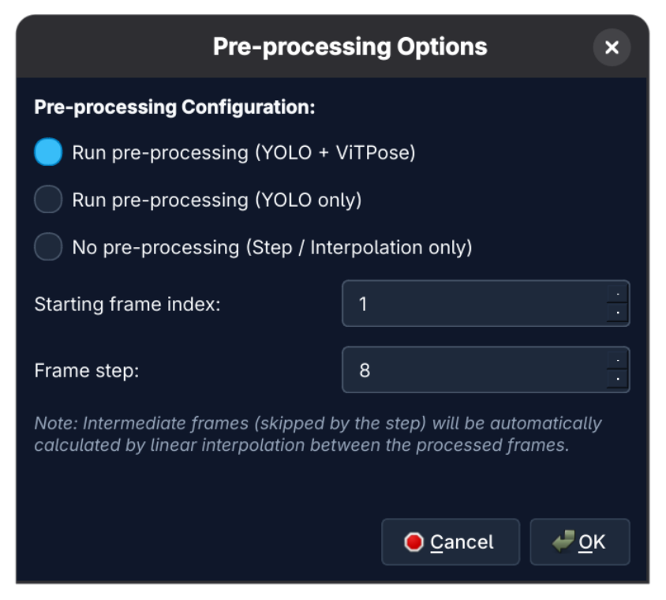
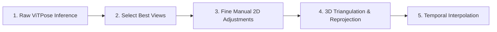
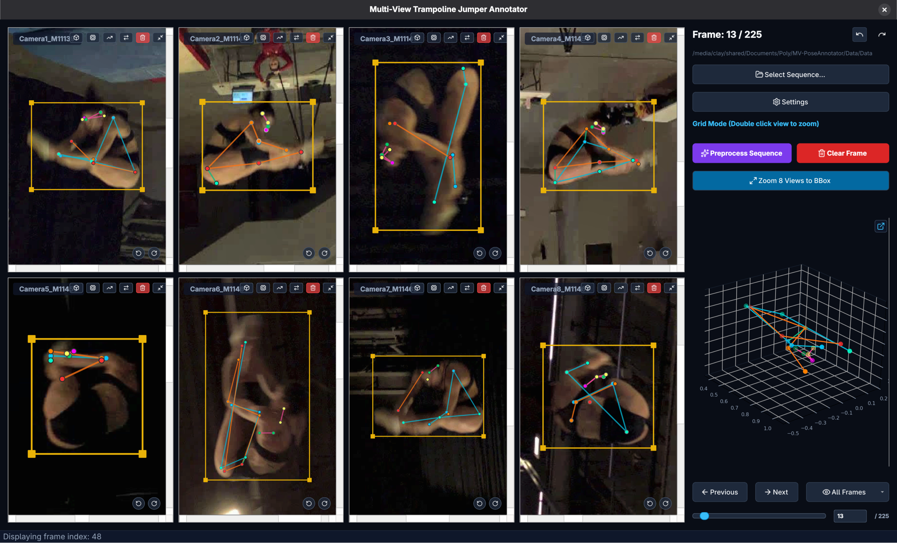
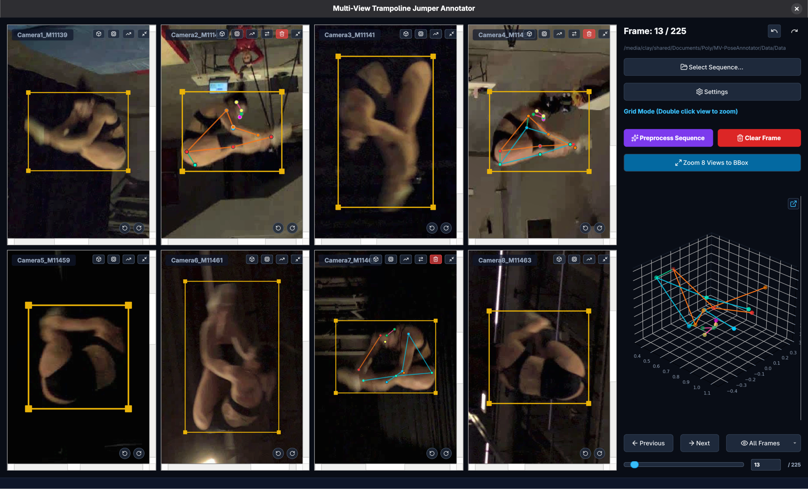
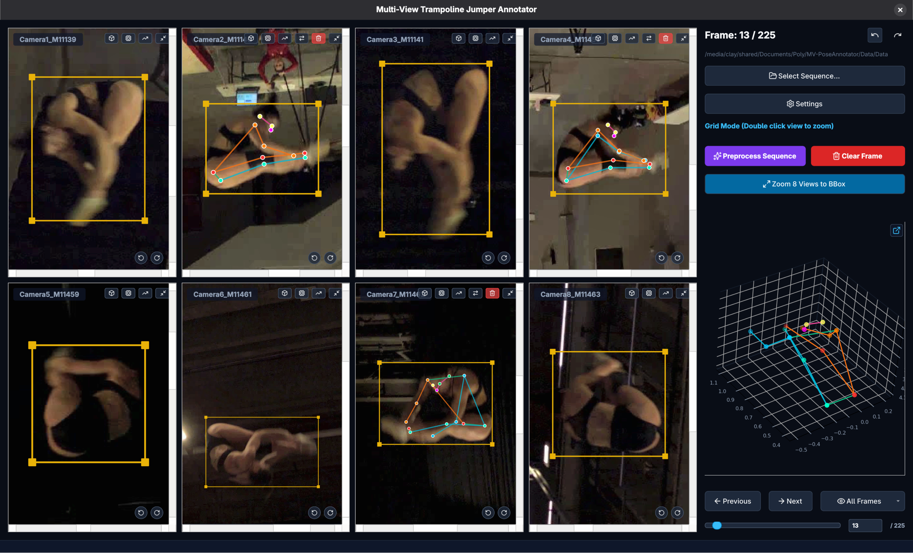
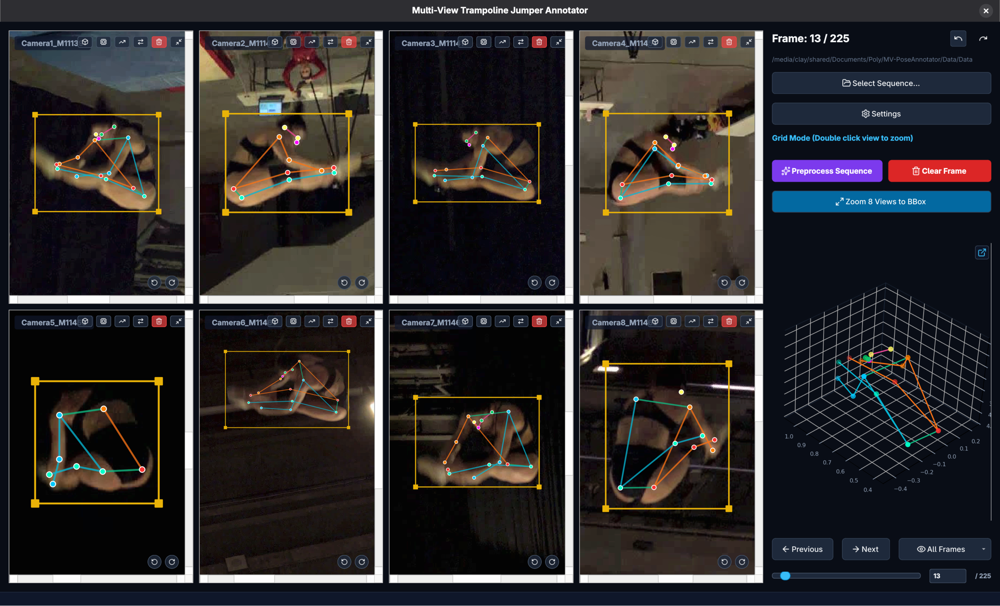
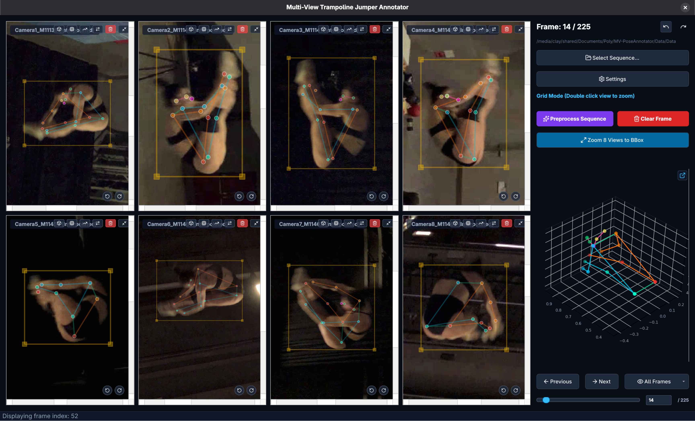
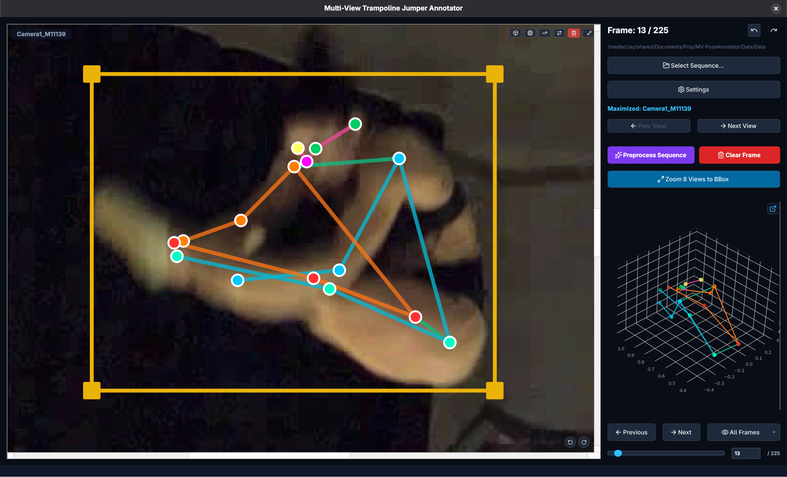

# Multi-View Pose Annotator (MV-PoseAnnotator)

<p align="center">
  <a href="https://www.python.org/"></a>
  <a href="https://www.riverbankcomputing.com/software/pyqt/"></a>
  <a href="https://pytorch.org/"></a>
  <a href="https://github.com/ViTAE-Transformer/ViTPose"></a>
  <a href="LICENSE"></a>
  <a href="https://cocodataset.org/#format-data"></a>
</p>

<p align="center">
  <b>English</b> | <b><a href="README_FR.md">Français</a></b>
</p>

---

A high-performance interactive tool built with **PyQt6** for annotating and refining 2D and 3D human poses on synchronized multi-camera setups (configured for 8 cameras).

The tool integrates automatic person detection (**YOLO**), 2D pose estimation (**ViTPose**), **3D triangulation (DLT)** using camera calibration parameters, **3D-to-2D reprojection**, and smooth **temporal linear interpolation** between keyframes.

---

## Table of Contents

- [Project Structure](#project-structure)
- [Installation and Getting Started](#installation-and-getting-started)
  - [1. Installing Dependencies](#1-installing-dependencies)
  - [2. Pretrained Models & Weights](#2-pretrained-models--weights)
  - [3. Running the Application](#3-running-the-application)
- [Camera Calibration & Configuration Files](#camera-calibration--configuration-files)
- [Startup Pre-processing Dialog](#startup-pre-processing-dialog)
- [Step-by-Step Annotation Workflow](#step-by-step-annotation-workflow)
  - [Step 1: Raw Pose Estimation](#step-1-raw-pose-estimation)
  - [Step 2: Selecting Reliable Camera Views](#step-2-selecting-reliable-camera-views)
  - [Step 3: Fine Manual 2D Adjustments](#step-3-fine-manual-2d-adjustments)
  - [Step 4: 3D Triangulation & Reprojection](#step-4-3d-triangulation--reprojection)
  - [Step 5: Temporal Interpolation](#step-5-temporal-interpolation)
- [Zoomed Camera View Controls](#zoomed-camera-view-controls)
- [Keyboard Shortcuts and Mouse Interactions](#keyboard-shortcuts-and-mouse-interactions)
- [Settings Menu](#settings-menu)
- [Annotation Format (COCO)](#annotation-format-coco)
- [License](#license)

---

## Project Structure

```text
MV-PoseAnnotator/
├── configs/                  # Camera parameters and calibration files
│   ├── Calib.toml            # Intrinsic/extrinsic matrices and lens distortion
│   └── camera_matrices.json  # Precomputed 3x4 projection matrices P = K * [R|t]
├── docs/                     # Documentation assets and illustrations
│   └── images/               # Workflow screenshots and diagrams
├── src/                      # Application source code
│   ├── backend.py            # YOLO and ViTPose inference wrappers
│   ├── constants.py          # COCO skeleton topology, colors, and camera definitions
│   ├── dialogs.py            # Dialog windows (Preprocessing, Settings, Directory selection)
│   ├── icons.py              # Lucide vector icon manager
│   ├── items.py              # Interactive graphics scene items (Keypoints, BBox, Skeleton)
│   ├── lucide_icons/         # Local SVG icon cache
│   ├── mainwindow.py         # Main window orchestrator and application logic
│   ├── visualizer3d.py       # Interactive Matplotlib / PyQt6 3D skeleton visualizer
│   ├── vitpose_model.py      # Standalone PyTorch ViTPose architecture (no mmpose dependency)
│   ├── widgets.py            # Per-camera graphical viewports and overlay controls
│   └── workers.py            # Asynchronous background batch processing threads
├── weights/                  # Directory for neural network weights (.pt, .pth)
├── main.py                   # Main entry point
├── requirements.txt          # Python dependencies
├── README.md                 # Primary documentation (English)
└── README_FR.md              # Documentation in French
```

---

## Installation and Getting Started

### 1. Installing Dependencies

#### Option A: Using `uv` (Recommended - Fast)

```bash
uv venv
source .venv/bin/activate
uv pip install -r requirements.txt
```

#### Option B: Using standard `pip`

```bash
python -m venv .venv
source .venv/bin/activate
pip install -r requirements.txt
```

### 2. Pretrained Models & Weights

Place the model checkpoint files in the `weights/` directory:

- **Person Detection (YOLO)**:
  - `weights/YOLO26s.pt` _(or `weights/yolov8s.pt`)_. If no weights file is found, Ultralytics will automatically download standard `yolov8s.pt`.
- **Pose Estimation (ViTPose)**:
  - `weights/ViTPose-s.pth` _(or any standard PyTorch ViTPose-s checkpoint)_.

### 3. Running the Application

#### Standard Launch (Interactive Directory Picker)

```bash
python main.py
```

#### Launch by Specifying 8 Camera Directories

```bash
python main.py Data/1_partie_0429_003-Camera1_M11139 Data/1_partie_0429_003-Camera2_M11140 Data/1_partie_0429_003-Camera3_M11141 Data/1_partie_0429_003-Camera4_M11458 Data/1_partie_0429_003-Camera5_M11459 Data/1_partie_0429_003-Camera6_M11461 Data/1_partie_0429_003-Camera7_M11462 Data/1_partie_0429_003-Camera8_M11463
```

Or using path globbing:

```bash
python main.py Data/1_partie_0429_003*
```

---

## Camera Calibration & Configuration Files

The application relies on two configuration files in `configs/` to enable 3D triangulation and 2D reprojection:

1. **`configs/Calib.toml`**: Contains intrinsic camera matrices $K$, radial/tangential distortion coefficients, and rotation ($R$) / translation ($t$) vectors for each camera.
2. **`configs/camera_matrices.json`**: Contains precomputed $3 \times 4$ projection matrices ($P = K \cdot [R \mid t]$) for each camera view.

---

## Startup Pre-processing Dialog

When opening a new sequence (or clicking **Preprocess Sequence**), the **Pre-processing Options** dialog is displayed:

<p align="center">
  
</p>

### Available Options:

1. **Pre-processing Mode:**
   - **Run pre-processing (YOLO + ViTPose)** _(Recommended)_: Automatically detects the athlete's bounding box with YOLO, then predicts the 17 COCO body keypoints using ViTPose.
   - **Run pre-processing (YOLO only)**: Detects bounding boxes only, without running keypoint estimation.
   - **No pre-processing (Step / Interpolation only)**: Skips automated neural network inference. Prepares step-based navigation without overwriting existing annotations.

2. **Starting frame index:**
   - Defines the initial frame index from which pre-processing and step partitioning start.

3. **Frame step:**
   - Defines the interval between annotated keyframes (e.g., `8`).
   - The tool processes frames `1, 9, 17, 25...`. Intermediate frames are smoothly computed via **linear interpolation**.

---

## Step-by-Step Annotation Workflow

The recommended workflow combines deep learning predictions with multi-view geometric triangulation for rapid, high-accuracy 2D and 3D annotation.



---

### Step 1: Raw Pose Estimation

Upon sequence initialization, all 8 cameras display the raw 2D detections predicted by ViTPose.
The **border color of each keypoint** reflects model confidence: a **bright white** border indicates high confidence (close to 1.0), whereas a **dark/black** border indicates low confidence (close to 0.0).

<p align="center">
  
</p>

---

### Step 2: Selecting Reliable Camera Views

Due to occlusions, motion blur, or challenging viewpoints, some camera views may contain estimation errors.

- Identify the cameras that offer the **clearest perspectives** with accurate skeleton estimations.
- On ambiguous or heavily occluded views, click the red **Clear Annotations (🗑️)** button to delete the inaccurate pose.

<p align="center">
  
</p>

---

### Step 3: Fine Manual 2D Adjustments

On the 2 to 4 retained views, zoom in to precisely adjust any keypoints that are slightly misaligned (ankles, wrists, head, etc.):

- Click and drag keypoints to correct their positions.
- Use the **Swap L/R (⇄)** button if the model confused left and right joints.

<p align="center">
  
</p>

---

### Step 4: 3D Triangulation & Reprojection

Once the retained camera views are properly adjusted:

1. The system computes the 3D pose in space via **multi-view DLT triangulation** and renders the real-time 3D skeleton in the right-hand panel.
2. Click the **Triangulate (📦)** icon on the cleared camera views: the triangulated 3D points are **projected directly onto the camera view**, instantly populating the missing annotations!
3. *(Optional)* Enable **Show 3D reprojection overlay** in Settings to display an evaluation layer: dashed pink lines and hollow circles appear between 2D points and the 3D projection to visually verify multi-view consistency.

<p align="center">
  
</p>

---

### Step 5: Temporal Interpolation

Using the `Frame step` parameter (e.g., every 8 frames):

- Navigate to the next keyframe (Right Arrow or _Next_ button).
- Intermediate frames are **automatically filled via linear interpolation** and displayed with semi-transparency, ensuring smooth temporal continuity across the video sequence.

<p align="center">
  
</p>

---

## Zoomed Camera View Controls

Hovering over or double-clicking any camera view reveals interactive on-canvas overlay buttons:

<p align="center">
  
</p>

### Button Descriptions:

|                             Icon                              | Button                       | Description                                                                                              |   Shortcut   |
| :-----------------------------------------------------------: | :--------------------------- | :------------------------------------------------------------------------------------------------------- | :----------: |
|        | **Toggle View / Zoom BBox**  | Toggles between bounding box centered zoom (_BBox Zoom_) and full image view (_Global View_).           | Double-click |
|               | **Triangulate View**         | Triangulates 3D points from other annotated views and projects them onto this camera.                    |      —       |
|               | **Run ViTPose**              | Re-runs the ViTPose model locally on the current view's bounding box.                                    | <kbd>Y</kbd> |
|       | **Predict Annotations**      | Predicts and propagates annotations from previous frames (constant velocity model).                      |      —       |
|  | **Swap Left/Right**          | Instantly swaps left and right symmetrical joints (shoulders, elbows, wrists, hips, knees, ankles, etc.). |      —       |
|           | **Clear Annotations**        | Deletes all keypoints on this camera for the current frame.                                              |      —       |
|         | **Rotate Clockwise**         | Rotates the camera canvas 90° clockwise (bottom-right button).                                           |      —       |
|        | **Rotate Counter-Clockwise** | Rotates the camera canvas 90° counter-clockwise (bottom-right button).                                   |      —       |

---

## Keyboard Shortcuts and Mouse Interactions

### 🖱️ Mouse Interactions

- **Double-click on view:** Maximize camera view (Focus mode) / Restore 8-camera grid.
- **Left-click + Drag on a keypoint:** Move keypoint position.
- **Shift + Left-click and Drag:** Draw a new bounding box.
- **BBox corner handles:** Resize bounding box proportionally.
- **BBox border edges:** Adjust box width or height.
- **Ctrl + Click on BBox border:** Translate / move the entire bounding box.
- **Right-click + Drag:** Pan the camera canvas.
- **Mouse Wheel:** Zoom in / out on the canvas.

### ⌨️ Keyboard Shortcuts

| Shortcut                                                                           | Action                                                              |
| :--------------------------------------------------------------------------------- | :------------------------------------------------------------------ |
| <kbd>→</kbd> / <kbd>←</kbd>                                                        | Next frame / Previous frame                                         |
| <kbd>Esc</kbd>                                                                     | Exit maximized single-camera view and return to 8-view grid mode   |
| <kbd>Y</kbd>                                                                       | Run ViTPose inference on the active view                            |
| <kbd>Del</kbd> / <kbd>Backspace</kbd>                                              | Delete selected keypoint or bounding box                            |
| <kbd>Del</kbd> + Left-click                                                        | Click-to-delete specific keypoint or bounding box                   |
| <kbd>Ins</kbd>                                                                     | Open context menu to add missing keypoints or bounding box          |
| <kbd>Ctrl</kbd> + <kbd>Z</kbd>                                                     | Undo last annotation action                                         |
| <kbd>Ctrl</kbd> + <kbd>Y</kbd> / <kbd>Ctrl</kbd> + <kbd>Shift</kbd> + <kbd>Z</kbd> | Redo last annotation action                                         |

---

## Settings Menu

Accessible via the **Settings** button in the main toolbar:

- **Keep feet at bottom and head at top (auto-rotation):** Automatically rotates the image canvas to keep the athlete upright based on the bounding box orientation.
- **Show 3D reprojection overlay:** Overlays visual dashed circles and discrepancy lines between annotated 2D points and 3D triangulated projections to monitor multi-view calibration alignment.
- **Update 3D triangulation in real-time during drag:** Updates the 3D skeleton visualization dynamically as you drag a 2D keypoint.
- **Delete bounding boxes when clearing annotations:** Also removes the bounding box when clearing annotations.
- **Show ViTPose confidence:** Dynamically adjusts keypoint border color in grayscale according to ViTPose confidence score (black for 0.0, white for 1.0).
- **ViTPose Threshold:** Minimum confidence cutoff for accepting keypoints during automated inference.
- **Interpolated Opacity:** Controls transparency level of linearly interpolated frames compared to confirmed keyframes.
- **Keypoint Size:** Adjusts on-screen radius of keypoint markers.

---

## Annotation Format (COCO)

Annotations are automatically saved in standard **COCO Person Keypoints** format inside the sequence's `GT/` directory under `annotation_<sequence_name>.json` (e.g., `GT/annotation_1_partie_0429_003.json`):

```json
{
  "images": [
    {
      "id": 1,
      "file_name": "1_partie_0429_003-Camera1_M11139/frame_000001.png",
      "width": 1920,
      "height": 1080
    }
  ],
  "annotations": [
    {
      "id": 1,
      "image_id": 1,
      "category_id": 1,
      "bbox": [850.0, 320.0, 220.0, 480.0],
      "keypoints": [
        960.0, 350.0, 2.0,
        ...
      ],
      "num_keypoints": 17,
      "iscrowd": 0
    }
  ],
  "categories": [
    {
      "id": 1,
      "name": "person"
    }
  ]
}
```

Keypoint visibility values follow the standard COCO definition:

- `0.0`: Unlabeled / occluded keypoint.
- `0.0 < v <= 1.0`: Keypoint predicted by ViTPose with confidence score `v`.
- `2.0`: Labeled, manually confirmed, or 3D-triangulated keypoint.

---

## License

This project is licensed under the **GNU General Public License v3.0 (GPLv3)**. See the [LICENSE](LICENSE) file for details.
