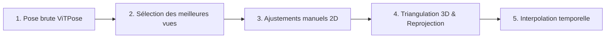

# Multi-View Pose Annotator (MV-PoseAnnotator)

<p align="center">
  <a href="https://www.python.org/"></a>
  <a href="https://www.riverbankcomputing.com/software/pyqt/"></a>
  <a href="https://pytorch.org/"></a>
  <a href="https://github.com/ViTAE-Transformer/ViTPose"></a>
  <a href="LICENSE"></a>
  <a href="https://cocodataset.org/#format-data"></a>
</p>

<p align="center">
  <b><a href="README.md">English</a></b> | <b>Français</b>
</p>

---

Outil interactif haute performance développé avec **PyQt6** pour l'annotation et la correction de poses humaines 2D et 3D sur des systèmes multi-caméras synchronisées (configuré pour 8 caméras).

L'outil combine la détection automatique (**YOLO**), l'estimation de pose (**ViTPose**), la **triangulation 3D (DLT)** à partir des paramètres de calibration des caméras, la **reprojection 3D vers 2D**, ainsi que l'**interpolation temporelle** entre les frames clés.

---

## Sommaire

- [Structure du Projet](#structure-du-projet)
- [Installation et Lancement](#installation-et-lancement)
  - [1. Installation des dépendances](#1-installation-des-dépendances)
  - [2. Poids et Modèles pré-entraînés (Weights)](#2-poids-et-modèles-pré-entraînés-weights)
  - [3. Lancement du projet](#3-lancement-du-projet)
- [Configuration et Fichiers de Calibration](#configuration-et-fichiers-de-calibration)
- [Boîte de dialogue à l'ouverture](#boîte-de-dialogue-à-louverture)
- [Guide d'utilisation pas-à-pas (Workflow d'annotation)](#guide-dutilisation-pas-à-pas-workflow-dannotation)
  - [Étape 1 : Pose brute (Inférence automatique)](#étape-1--pose-brute-inférence-automatique)
  - [Étape 2 : Sélection des meilleures vues](#étape-2--sélection-des-meilleures-vues)
  - [Étape 3 : Ajustements manuels fins](#étape-3--ajustements-manuels-fins)
  - [Étape 4 : Triangulation 3D et Reprojection](#étape-4--triangulation-3d-et-reprojection)
  - [Étape 5 : Interpolation temporelle](#étape-5--interpolation-temporelle)
- [Contrôles et Boutons sur la vue d'une caméra (Vue Zoomée)](#contrôles-et-boutons-sur-la-vue-dune-caméra-vue-zoomée)
- [Raccourcis clavier et Interactions Souris](#raccourcis-clavier-et-interactions-souris)
- [Menu Paramètres (Settings)](#menu-paramètres-settings)
- [Format des Annotations (COCO)](#format-des-annotations-coco)
- [Licence](#licence)

---

## Structure du Projet

```text
MV-PoseAnnotator/
├── configs/                  # Configurations et calibration des caméras
│   ├── Calib.toml            # Paramètres intrinsèques/extrinsèques & distorsion
│   └── camera_matrices.json  # Matrices de projection P = K * [R|t]
├── docs/                     # Documentation et illustrations
│   └── images/               # Captures d'écran du workflow
├── src/                      # Code source de l'application
│   ├── backend.py            # Inférence YOLO et ViTPose
│   ├── constants.py          # Définition du squelette COCO, couleurs et caméras
│   ├── dialogs.py            # Boîtes de dialogue (Prétraitement, Réglages, Dossiers)
│   ├── icons.py              # Gestionnaire d'icônes vectorielles Lucide
│   ├── items.py              # Éléments graphiques interactifs (Keypoints, BBox, Squelette)
│   ├── lucide_icons/         # Cache des icônes SVG
│   ├── mainwindow.py         # Fenêtre principale et logique d'orchestration
│   ├── visualizer3d.py       # Visualiseur 3D interactif Matplotlib / PyQt6
│   ├── vitpose_model.py      # Architecture PyTorch ViTPose (sans dépendance mmpose)
│   ├── widgets.py            # Vue graphique par caméra et contrôles incrustés
│   └── workers.py            # Threads asynchrones d'inférence par lots
├── weights/                  # Dossier pour les poids des réseaux de neurones (.pt, .pth)
├── main.py                   # Point d'entrée principal de l'application
├── requirements.txt          # Dépendances Python
└── README.md                 # Documentation principale (Anglais)
```

---

## Installation et Lancement

### 1. Installation des dépendances

#### Option A : Avec `uv` (Recommandé - Ultra rapide)

```bash
uv venv
source .venv/bin/activate
uv pip install -r requirements.txt
```

#### Option B : Avec `pip`

```bash
python -m venv .venv
source .venv/bin/activate
pip install -r requirements.txt
```

### 2. Poids et Modèles pré-entraînés (Weights)

Placez les fichiers de poids dans le dossier `weights/` :

- **Détection des personnes (YOLO)** :
  - `weights/YOLO26s.pt` _(ou à défaut `weights/yolov8s.pt`)_. Si aucun fichier n'est présent, Ultralytics téléchargera automatiquement `yolov8s.pt`.
- **Estimation de pose (ViTPose)** :
  - `weights/ViTPose-s.pth` _(ou tout point de contrôle ViTPose-s au format PyTorch standard)_.

### 3. Lancement du projet

#### Lancement standard (Explorateur de dossiers interactif)

```bash
python main.py
```

#### Lancement en spécifiant les dossiers des 8 caméras

```bash
python main.py Data/1_partie_0429_003-Camera1_M11139 Data/1_partie_0429_003-Camera2_M11140 Data/1_partie_0429_003-Camera3_M11141 Data/1_partie_0429_003-Camera4_M11458 Data/1_partie_0429_003-Camera5_M11459 Data/1_partie_0429_003-Camera6_M11461 Data/1_partie_0429_003-Camera7_M11462 Data/1_partie_0429_003-Camera8_M11463
```

Ou plus simplement avec du _globbing_ :

```bash
python main.py Data/1_partie_0429_003*
```

---

## Configuration et Fichiers de Calibration

L'application s'appuie sur deux fichiers situés dans `configs/` pour assurer la triangulation et la reprojection 3D :

1. **`configs/Calib.toml`** : Contient les matrices intrinsèques $K$, les coefficients de distorsion radiale/tangentielle, ainsi que les vecteurs de rotation $R$ et translation $t$ pour chaque caméra.
2. **`configs/camera_matrices.json`** : Contient les matrices de projection $3 \times 4$ précalculées ($P = K \cdot [R \mid t]$) pour chaque caméra.

---

## Boîte de dialogue à l'ouverture

Lors du chargement d'une nouvelle séquence d'images (ou lors d'un clic sur **Preprocess Sequence**), la boîte de dialogue **Pre-processing Options** s'affiche pour configurer le traitement initial :

<p align="center">
  
</p>

### Options disponibles :

1. **Choix du mode de pré-traitement :**
   - **Run pre-processing (YOLO + ViTPose)** _(Recommandé)_ : Détecte automatiquement la boîte englobante (_bounding box_) de la personne avec YOLO, puis estime les 17 points clés corporels (format COCO) avec ViTPose.
   - **Run pre-processing (YOLO only)** : Détecte uniquement la boîte englobante de la personne sans estimer les points clés.
   - **No pre-processing (Step / Interpolation only)** : Ne lance aucune inférence automatique par réseau de neurones. Prépare la navigation par pas temporel sans écraser d'annotations existantes.

2. **Starting frame index (Frame de départ) :**
   - Définit le numéro de la première frame à partir de laquelle le pré-traitement et le découpage temporel débutent.

3. **Frame step (Pas temporel entre les frames) :**
   - Définit l'intervalle entre deux frames annotées (par exemple `8`).
   - L'outil traitera les frames `1, 9, 17, 25...`. Les frames intermédiaires seront calculées de manière fluide par **interpolation linéaire**.

---

## Guide d'utilisation pas-à-pas (Workflow d'annotation)

Le flux de travail recommandé permet d'obtenir des annotations 2D et 3D parfaites en un minimum de temps grâce à la combinaison IA + Triangulation géométrique.



---

### Étape 1 : Pose brute (Inférence automatique)

Au démarrage ou après le prétraitement, les 8 caméras affichent les détections 2D brutes produites par ViTPose.
La couleur du **contour des points clés** reflète l'indice de confiance du modèle : plus le contour est **blanc**, plus l'estimateur est confiant ; à l'inverse, plus le contour est **sombre / noir**, moins la confiance est élevée.

<p align="center">
  
</p>

---

### Étape 2 : Sélection des meilleures vues

En raison d'occlusions, de flou de mouvement ou d'angles complexes, certaines vues peuvent comporter des erreurs d'estimation importantes.

- Identifiez les caméras qui offrent les **meilleurs points de vue** (angles dégagés, squelette bien estimé).
- Sur les vues problématiques ou ambiguës, cliquez sur le bouton rouge **Supprimer les annotations (🗑️)** pour effacer la pose erronée.

<p align="center">
  
</p>

---

### Étape 3 : Ajustements manuels fins

Sur les 2 à 4 caméras conservées, zoomez sur les vues pour ajuster avec précision les points clés manquants ou légèrement décalés (chevilles, poignets, tête...) :

- Cliquez et glissez un point clé pour corriger sa position.
- Utilisez le bouton **Swap L/R (⇄)** si le modèle a interverti le côté gauche et le côté droit.

<p align="center">
  
</p>

---

### Étape 4 : Triangulation 3D et Reprojection

Une fois que les caméras sélectionnées sont bien ajustées :

1. Le système calcule la pose 3D dans l'espace grâce à l'algorithme de **triangulation DLT multi-vues** et affiche le squelette 3D interactif dans le panneau latéral droit.
2. Cliquez sur l'icône **Triangulate (📦)** sur les caméras dont les annotations ont été effacées : les points 3D issus de la triangulation sont **projetés directement sur la vue**, complétant instantanément les annotations manquantes !
3. *(Optionnel)* Vous pouvez activer l'option **Show 3D reprojection overlay** dans les paramètres pour afficher un calque d'évaluation : des lignes et cercles pointillés roses apparaissent entre vos points 2D et la projection 3D afin de vérifier visuellement qu'il n'y a pas d'écart ou de décalage anormal.

<p align="center">
  
</p>

---

### Étape 5 : Interpolation temporelle

Grâce au paramètre `Frame step` (ex: toutes les 8 frames) :

- Naviguez vers la frame clé suivante (flèche droite ou bouton _Next_).
- Les frames intermédiaires sont **automatiquement complétées par interpolation linéaire** et s'affichent avec une légère transparence, assurant une continuité temporelle parfaite tout au long de la séquence vidéo.

<p align="center">
  
</p>

---

## Contrôles et Boutons sur la vue d'une caméra (Vue Zoomée)

Lorsque vous survolez ou zoomez sur une vue caméra particulière (par double-clic), une série de boutons d'action rapide s'affiche en incrustation :

<p align="center">
  
</p>

### Description détaillée des boutons :

|                             Icône                             | Bouton                       | Description                                                                                                                               |  Raccourci   |
| :-----------------------------------------------------------: | :--------------------------- | :---------------------------------------------------------------------------------------------------------------------------------------- | :----------: |
|        | **Toggle View / Zoom BBox**  | Alterne entre le centrage automatique sur la boîte englobante (_BBox Zoom_) et la vue d'ensemble de l'image de la caméra (_Global View_). | Double-clic  |
|               | **Triangulate View**         | Reconstruit les points clés 3D à partir des autres caméras annotées et les projette sur cette caméra.                                     |      —       |
|               | **Run ViTPose**              | Relance l'inférence du modèle ViTPose localement sur la boîte englobante de cette vue.                                                    | <kbd>Y</kbd> |
|       | **Predict Annotations**      | Extrapole et prédit les annotations à partir des frames précédentes (vitesse constante).                                                  |      —       |
|  | **Swap Left/Right**          | Inverse instantanément les articulations gauches et droites (épaules, coudes, poignets, genoux, etc.).                                    |      —       |
|           | **Clear Annotations**        | Efface l'ensemble des points clés sur cette caméra pour la frame courante.                                                                |      —       |
|         | **Rotate Clockwise**         | Fait pivoter la vue de 90° dans le sens des aiguilles d'une montre (en bas à droite).                                                     |      —       |
|        | **Rotate Counter-Clockwise** | Fait pivoter la vue de 90° dans le sens inverse des aiguilles d'une montre (en bas à droite).                                             |      —       |

---

## Raccourcis clavier et Interactions Souris

### 🖱️ Interactions Souris

- **Double-clic sur une vue :** Agrandir la caméra sélectionnée en plein écran (Mode Focus) / Revenir à la grille des 8 caméras.
- **Clic gauche + Glisser sur un point :** Déplacer un point clé.
- **Shift + Clic gauche glissé :** Dessiner une nouvelle boîte englobante (_Bounding Box_).
- **Poignées d'angle de la BBox :** Redimensionner la boîte englobante.
- **Bordures de la BBox :** Ajuster la largeur ou la hauteur de la boîte.
- **Ctrl + Clic sur le bord de la BBox :** Déplacer / translater l'ensemble de la boîte englobante.
- **Clic droit + Glisser :** Déplacer la vue (_Pan_ du canevas caméra).
- **Molette de la souris :** Zoomer / Dézoomer dans l'image de la caméra.

### ⌨️ Raccourcis Clavier

| Raccourci                                                                          | Action                                                                   |
| :--------------------------------------------------------------------------------- | :----------------------------------------------------------------------- |
| <kbd>→</kbd> / <kbd>←</kbd>                                                        | Frame suivante / Frame précédente                                        |
| <kbd>Échap</kbd>                                                                   | Quitter la vue agrandie et revenir à la grille des 8 caméras             |
| <kbd>Y</kbd>                                                                       | Lancer l'estimation ViTPose sur la vue active                            |
| <kbd>Suppr</kbd> / <kbd>Retour arrière</kbd>                                       | Supprimer le point clé ou la bounding box sélectionnée                   |
| <kbd>Suppr</kbd> + Clic gauche                                                     | Clic direct pour supprimer un point clé ou une boîte                     |
| <kbd>Inser</kbd>                                                                   | Ouvrir le menu contextuel pour ajouter un point clé manquant ou une BBox |
| <kbd>Ctrl</kbd> + <kbd>Z</kbd>                                                     | Annuler la dernière action (Undo)                                        |
| <kbd>Ctrl</kbd> + <kbd>Y</kbd> / <kbd>Ctrl</kbd> + <kbd>Shift</kbd> + <kbd>Z</kbd> | Rétablir la dernière action (Redo)                                       |

---

## Menu Paramètres (Settings)

Accessible via le bouton **Settings** de la barre d'outils principale :

- **Keep feet at bottom and head at top (auto-rotation) :** Oriente automatiquement l'image pour maintenir l'athlète à la verticale selon l'angle de la boîte englobante.
- **Show 3D reprojection overlay :** Affiche un calque d'évaluation avec des cercles et lignes pointillées pour visualiser l'écart entre vos points 2D annotés et la reprojection 3D issue de la triangulation, permettant de repérer rapidement tout décalage géométrique.
- **Update 3D triangulation in real-time during drag :** Recalcule et actualise le squelette 3D en direct lorsque vous déplacez un point clé à la souris.
- **Delete bounding boxes when clearing annotations :** Supprime également la BBox lors de l'effacement des annotations.
- **Show ViTPose confidence :** Ajuste dynamiquement la nuance de gris du contour des points 2D selon leur indice de confiance (du noir pour 0 au blanc pour 1).
- **ViTPose Threshold :** Seuil de confiance minimal pour la prise en compte d'un point clé lors de l'inférence.
- **Interpolated Opacity :** Niveau de transparence pour visualiser clairement les poses interpolées par rapport aux poses manuellement validées.
- **Keypoint Size :** Curseur pour ajuster le rayon d'affichage des points clés à l'écran.

---

## Format des Annotations (COCO)

Les annotations sont automatiquement enregistrées au format standard **COCO Keypoints** dans le sous-dossier `GT/` situé dans le répertoire de la séquence, sous le nom `annotation_<nom_sequence>.json` (par exemple `GT/annotation_1_partie_0429_003.json`) :

```json
{
  "images": [
    {
      "id": 1,
      "file_name": "1_partie_0429_003-Camera1_M11139/frame_000001.png",
      "width": 1920,
      "height": 1080
    }
  ],
  "annotations": [
    {
      "id": 1,
      "image_id": 1,
      "category_id": 1,
      "bbox": [850.0, 320.0, 220.0, 480.0],
      "keypoints": [
        960.0, 350.0, 2.0,
        ...
      ],
      "num_keypoints": 17,
      "iscrowd": 0
    }
  ],
  "categories": [
    {
      "id": 1,
      "name": "person"
    }
  ]
}
```

Les valeurs de visibilité des points clés suivent la convention COCO :

- `0.0` : Point non annoté / masqué.
- `0.0 < v <= 1.0` : Point prédit par ViTPose avec score de confiance `v`.
- `2.0` : Point annoté, ajusté manuellement ou confirmé par triangulation 3D.

---

## Licence

Ce projet est distribué sous licence libre **GNU General Public License v3.0 (GPLv3)**. Consultez le fichier [LICENSE](LICENSE) pour plus d'informations.
